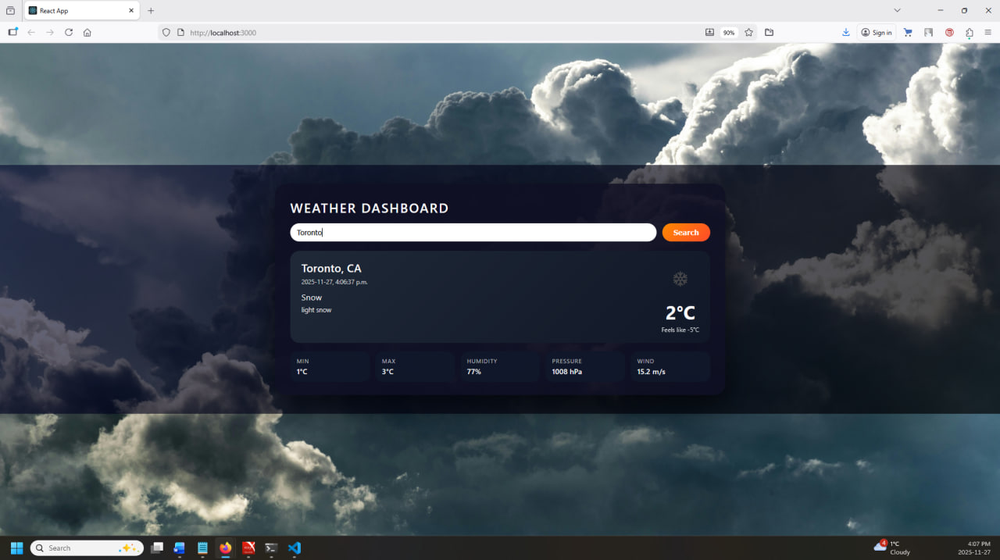
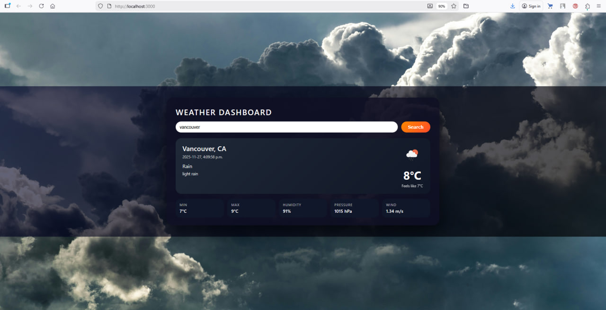

# Labtest2 – Weather Dashboard

A simple React weather dashboard that shows the **current weather** for any city using the **OpenWeatherMap API**.
Users can search by city name and see temperature, conditions, humidity, pressure, and wind speed.

---

## Live Demo

Hosted on Vercel:


---

## Features

- Search weather by **city name**
- Displays:
  - City and country
  - Current temperature and "feels like" temperature
  - Min / Max temperature
  - Weather condition and description
  - Humidity, pressure, and wind speed
  - Weather icon from OpenWeatherMap
- Modern UI with a card-style layout and background image
- Built with **React hooks** (`useState`, `useEffect`) and **props** between components

---

## Tech Stack

- **React** (Create React App)
- **Axios** for API calls
- **OpenWeatherMap API** for weather data
- Hosted on **Vercel**

---

## API Used

- **OpenWeatherMap – Current Weather Data**
  - Endpoint: `https://api.openweathermap.org/data/2.5/weather`
  - Example:
    `https://api.openweathermap.org/data/2.5/weather?q=Toronto&appid=YOUR_API_KEY&units=metric`

---

## Getting Started (Local Setup)

1. Clone the repository:

   ```bash
   git clone https://github.com/YOUR_GITHUB_USERNAME/101466133_comp3123_labtest2.git
   cd 101466133_comp3123_labtest2
   ```
2. Install dependencies:

```bash
npm install
```

3. Configure API key:

* Open `src/config.js`.
* Set `OPEN_WEATHER_API_KEY` to your OpenWeatherMap API key.

4. Run the app:

```bash
npm start
```

The app will open at `http://localhost:3000`


## Screenshots


* **Main screen – default city (Toronto)**


* **Search result – Vancouver**
